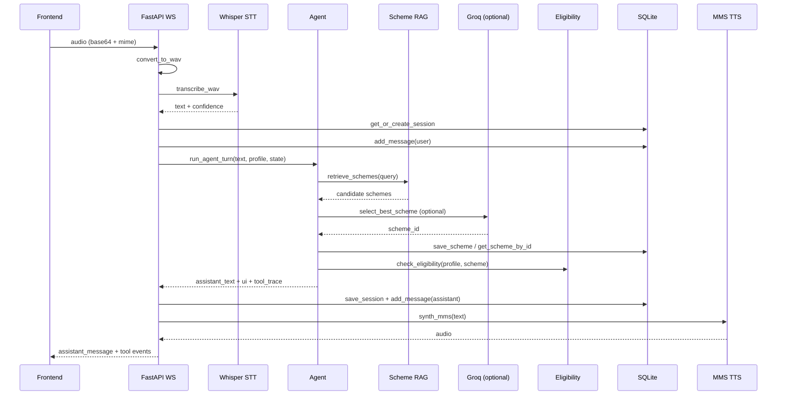
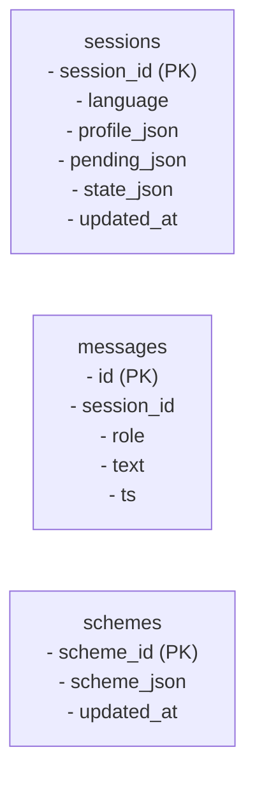

# SevaSetu Architecture

## Overview
The backend is a FastAPI WebSocket service that accepts audio, runs STT, executes a deterministic agent loop (retrieval + eligibility + slot-fill), and returns both text and synthesized audio. Sessions, messages, and cached schemes are stored in SQLite. The frontend renders the conversation and a tool timeline.

## Agent Lifecycle (Sequence)


## Decision Flow (run_agent_turn)
```mermaid
flowchart TD
    A[User utterance] --> B{STT confidence < 0.35?}
    B -- yes --> R[Respond: ask to repeat]
    B -- no --> C{Slot-filling awaiting?}
    C -- yes --> D[Parse slot answer]
    D --> E{Valid?}
    E -- no --> Q[Ask same question again]
    E -- yes --> F{More missing fields?}
    F -- yes --> G[Ask next missing question]
    F -- no --> H[Load scheme by id]
    H --> I[Eligibility check]
    I --> J[Respond with eligibility result]
    C -- no --> K[Retrieve schemes (BM25)]
    K --> L{No schemes?}
    L -- yes --> M[Respond: no scheme found]
    L -- no --> N[Select best scheme]
    N --> O[Eligibility check]
    O --> P{Needs more info?}
    P -- yes --> G
    P -- no --> J
```

## Memory and Persistence

### In-memory profile fields
- `profile`: user attributes (age, gender, state, income_annual, occupation, etc.).
- `pending`: contradiction resolution for critical fields.
- `state`: ephemeral conversation state (slot-filling with `slot = {scheme_id, missing, awaiting}`).

### SQLite tables


Notes:
- `schemes` caches the selected scheme so slot-filling can re-check eligibility later by `scheme_id`.
- `messages` is a lightweight conversation log for debugging and analytics.

## Prompts and LLM Usage

### Planner prompt (optional, not wired yet)
The file `backend/app/agent/prompts.py` contains a planner template designed for a future LLM-based planner. The current agent flow does not invoke it.

### Scheme selection (Groq optional)
When `LLM_PROVIDER=groq` and `GROQ_API_KEY` are set, the agent re-ranks the top retrieved schemes using a short prompt that returns the best `scheme_id`. If Groq is not configured, the top BM25 result is used.

## Key Files
- `backend/app/main.py`: WebSocket server, STT/TTS orchestration, persistence.
- `backend/app/agent/agent.py`: core decision flow and slot-filling.
- `backend/app/memory.py`: profile parsing and contradiction handling.
- `backend/app/tools/scheme_rag.py`: BM25 retrieval + optional Groq selection.
- `backend/app/tools/eligibility.py`: rule-based eligibility check.
- `backend/app/db.py`: SQLite schema and helpers.
